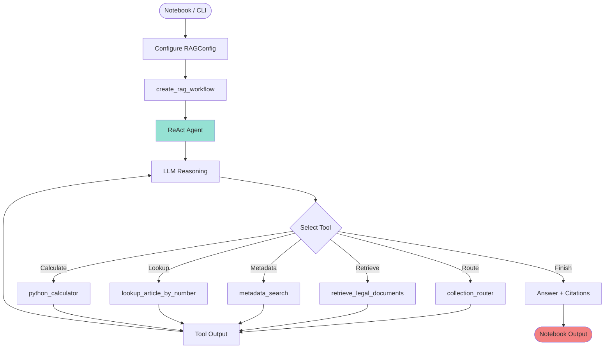
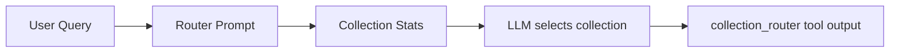

# Developer Guide

This guide provides a detailed overview of the RAG system's architecture, components, and development practices.

---

## 📊 System Architecture

The system is now a single, modular LangGraph ReAct agent that runs primarily from notebooks. `rag_system.workflow` exposes factory functions so Jupyter notebooks, services, or the legacy CLI can all create the exact same workflow without duplicated wiring.

### Overall Architecture



### Collection Router Logic



The router now only decides **which legal collection** to search. There is no longer a DATCOM branch; all queries stay inside the legal ReAct agent. The router prompt lists collection names plus document counts and asks the LLM to pick the most relevant one (or fall back to the largest non-empty collection).

---

## 📂 Project Structure

```
rag_system/
├── workflow.py              # Notebook/API helper for building workflows
├── query_rag_pg.py          # Legacy CLI wrapper
├── agent.py                 # LangGraph workflow builder
├── node.py                  # ReAct agent node
├── state.py                 # GraphState definition
├── tool/                    # Router, retrieval, metadata, calculator tools
├── application/             # Chunking & hierarchical retrieval use cases
├── domain/                  # Entities/value objects
├── infrastructure/          # Postgres repositories & schema helpers
├── build/                   # Indexing and preprocessing pipeline
└── notebooks/
    └── legal_rag_workflow.ipynb  # Primary interactive entry point
```

### Module Responsibilities

| Module | Responsibility |
|:---|:---|
| `workflow.py` | Exposes `create_llm`, `create_rag_workflow`, `run_query` for notebooks/services. |
| `agent.py` | Builds the LangGraph state graph and wires agent nodes. | 
| `node.py` | Implements the ReAct reasoning loop, formatting logic, and error handling. | 
| `tool/` | LangChain-compatible tools (router, flat/hierarchical retrieval, metadata search, calculator). | 
| `build/` | Offline preprocessing + indexing pipeline for PGVector. |
| `notebooks/` | Default developer UX for interactive experimentation. |
| `query_rag_pg.py` | Legacy CLI maintained for automation compatibility. |

---

## 🔧 Building the Index (`build_all.sh`)

The `build_all.sh` script is the primary way to build and manage the vector database.

### Usage

- **Incremental Build (Default)**: Processes new documents and skips existing database collections.
  ```bash
  ./build_all.sh
  ```
- **Force Rebuild**: Deletes and rebuilds all collections from scratch. Use this if you change the chunking strategy or embedding model.
  ```bash
  ./build_all.sh --force
  ```
- **Rebuild Only**: Skips the document preprocessing step and rebuilds the index from existing Markdown files.
  ```bash
  ./build_all.sh --rebuild-only
  ```

### Data Flow

1.  **Input**: Documents in `rag_system/documents/`
2.  **Preprocess**: `preprocess.py` converts files to clean Markdown, output to `rag_system/processed_md/`.
3.  **Index**: `indexer.py` chunks the Markdown, generates embeddings, and stores them in the PostgreSQL database.

---

## 📦 Database Setup (PostgreSQL + PGVector)

The recommended setup uses Docker Compose.

### 1. Start the Database

```bash
# This command starts a PostgreSQL container named 'rag_db'
# listening on localhost:5433.
docker compose up -d
```

### 2. Verify

```bash
# Check that the container is running and healthy
docker compose ps

# Connect and verify the 'vector' extension is enabled
docker exec -it rag_db psql -U user -d rag_db -c "SELECT * FROM pg_extension WHERE extname = 'vector';"
```

### 3. Stop and Clean Up

```bash
# Stop the container but preserve data
docker compose stop

# Stop and remove the container (data volume is preserved)
docker compose down

# Stop, remove the container, AND delete all data
docker compose down -v
```

For manual installation instructions, refer to the official documentation for PostgreSQL and PGVector.

---

## 🔌 Subgraph Integration

The RAG system is designed to be a self-contained subgraph that can be integrated into a larger multi-agent system.

### Core Concept

The `create_rag_subgraph` function in `rag_system/subgraph.py` returns a compiled LangGraph object. The parent graph delegates tasks to this subgraph, which handles all internal logic and returns the final answer.

### Integration Steps

1.  **Import**: Import `create_rag_subgraph` and `RAGConfig`.
    ```python
    from rag_system.subgraph import create_rag_subgraph
    from rag_system.config import RAGConfig
    ```

2.  **Initialize**: Create the RAG configuration and the subgraph node.
    ```python
    llm = ChatOpenAI(model="your-model")
    rag_config = RAGConfig.from_env()
    rag_node = create_rag_subgraph(llm, rag_config, name="rag_expert")
    ```

3.  **Add to Graph**: Add the `rag_node` to your supervisor graph.
    ```python
    supervisor_graph.add_node("rag_expert", rag_node)
    ```

4.  **Route**: Create conditional edges in your supervisor to route tasks to the `rag_expert` node.
    ```python
    supervisor_graph.add_conditional_edges(
        "router_node",
        lambda state: "rag_expert" if should_delegate(state) else "other_tool",
        {"rag_expert": "rag_expert", "other_tool": "other_tool_node"}
    )
    supervisor_graph.add_edge("rag_expert", "supervisor_evaluator_node")
    ```

### Data Flow

-   **Input**: The user's question should be the last message in the `messages` list of the graph state.
-   **Output**: The subgraph's answer is placed in the `generation` field of the state.

---
**Last Updated**: 2025-10-08
